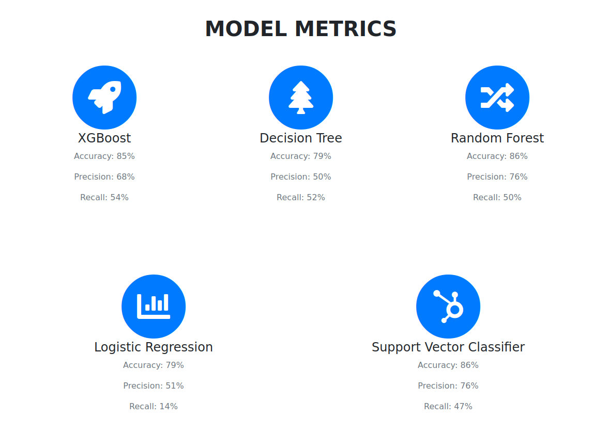

# Billboard Hit Predictor


A predictive model to predict whether a song can be a billboard hit at the end of year or not. Multiple song's audio features from Spotify data are used.


## Demo

Live at: http://billboardhitpredictor.herokuapp.com/


## Dataset

A random spotify songs dataset containing audio features is taken from [here](https://jovian.ai/zhangxm963/spotify-dataframe/v/39/files?filename=spotify-dataset-19212020-160k-tracks/data.csv) or just simply take the file from /notebook/data/ folder in this repository.

The Spotify dataset (titled data.csv) consists of 160,000+ tracks from 1921-2020 found in Spotify as of June 2020. Collected by Kaggle user and Turkish Data Scientist Yamaç Eren Ay, the data was retrieved and tabulated from the Spotify Web API. Each row in the dataset corresponds to a track, with variables such as the title, artist, and year located in their respective columns. Aside from the fundamental variables, musical elements of each track, such as the tempo, danceability, and key, were likewise extracted; the algorithm for these values were generated by Spotify based on a range of technical parameters.
## Steps 

* Scrape each year-end(2001 to 2021) billboard hot 100 songs from wikipedia and using Spotify Developer API add songs audio features to it.
* Take some random (hit and not hit songs) data from the downloaded dataset, and do some feature engineering.
* Merge both the datasets and using **Musixmatch API** extract lyircs of each song, so sentiment of the song can be predicted.
* Also separate data required for model training and testing and data which will be used in front end.
* Then using data which was saved for model creation, build different machine learning models and see it's accuracy with respect to testing data.
* Create a Flask UI, where user can search 2021-2022 year songs and select a ML model to get prediction that whether it will be hit or not.




    
## API Key Creation
* If you need to run the jupyter notebook's code(***where magic happens***) you need to create Spotify developer client ID and secret key.
* Create or Log in into your Spotify Developer Account [here](https://developer.spotify.com/dashboard/).
* Once in your dashboard, click the “**Create a Client ID**” button to fill out the form to create an app or hardware integration Even if you are not creating an app, but to get a Client ID and access data, you have to fill out the form.
* On your developer dashboard page, click on the new app you just created, and on the app’s dashboard page you will find your Client ID just under the header name of your app. Click “**Show Client Secret**” to access your secondary Client ID.

## Installation

* Clone this repository in your local machine.

* Then, install all the dependencies:

```
    pip install -r requirements.txt
```


    
## To Run

Inside your terminal/command prompt from your project directory, run the project,

```
    python main.py
```

Go to your browser and type http://127.0.0.1:5000/ in the address bar.
## References

* https://medium.com/@maxtingle/getting-started-with-spotifys-api-spotipy-197c3dc6353b
* https://www.geeksforgeeks.org/python-sentiment-analysis-using-vader/
* https://maelfabien.github.io/machinelearning/Explorium6/#lyrics-sentiment
